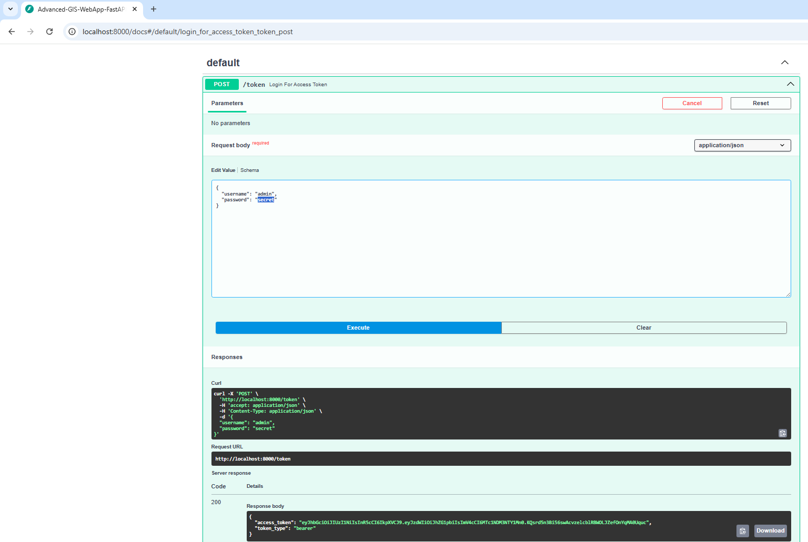
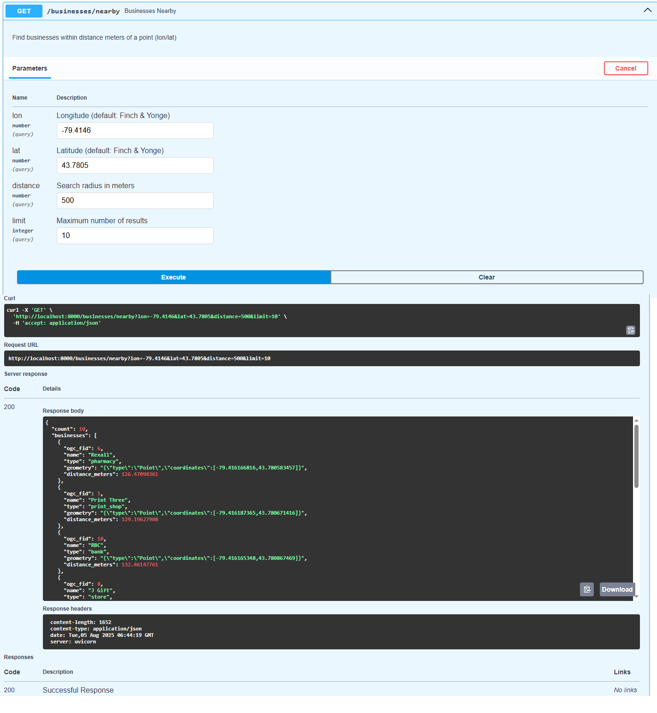

# Advanced GIS WebApp – Phase 3: Modern GIS API with FastAPI & PostGIS  

**Evolution of Phase 2**: This phase upgrades the backend to FastAPI, adding JWT authentication, improved spatial queries, and Swagger UI for interactive API exploration. Built as a containerized microservice.  

📍 **Key Advancements**:  
- 🚀 FastAPI performance & async support  
- 🔒 JWT Authentication  
- 📡 Auto-generated Swagger/OpenAPI docs  
- 🐳 Dockerized deployment  

---

## 🧰 Core Technologies  
| Category          | Technologies Used |  
|-------------------|-------------------|  
| **Backend**       | FastAPI, Python 3.9 |  
| **Database**      | PostgreSQL + PostGIS |  
| **Auth**          | JWT, OAuth2PasswordBearer |  
| **Deployment**    | Docker, Uvicorn |  
| **GIS**           | PostGIS spatial queries (`ST_DWithin`, `ST_GeomFromGeoJSON`) |  

---

## 📸 Screenshot Guide  

### **Authentication Flow**  
| Swagger UI Auth | pgAdmin User Table |  
|-----------------|-------------------|  
|  |  |  

### **CRUD Operations**  
| Endpoint         | Action             | Database Impact |  
|-----------------|-------------------|----------------|  
| `POST /businesses` | Add new business |  |  
| `PUT /businesses/{id}` | Update location |  |  
| Spatial query (`/nearby`) | Buffer analysis |  |  

*(Place screenshots side-by-side in a 2-column table for visual comparison)*  

---

## 🌟 Key Features  
- **JWT Authentication**: Secure token-based access  
- **Real-time Spatial Queries**: 500m buffer analysis, nearest-business search  
- **Self-documenting API**: Interactive Swagger UI built-in  
- **Containerized**: Ready for cloud deployment  

---

## 🔗 Project Evolution  
This is **Phase 3** of a multi-phase GIS system:  
1. ✅ **Phase 1**: [Static Frontend](https://github.com/yourusername/Advanced-GIS-WebApp-Frontend)  
2. ✅ **Phase 2**: [Flask Backend](https://github.com/yourusername/Advanced-GIS-WebApp-Backend)  
3. 🔥 **Phase 3**: FastAPI Microservice (this repo)  
4. 🚧 Phase 4: ML Integration (Coming Soon)  

---

## 👤 Author  
**Essam Afifi**  
GIS Full-Stack Developer | Data & AI Consultant  
[LinkedIn](#) | esstoronto#gmail.com  