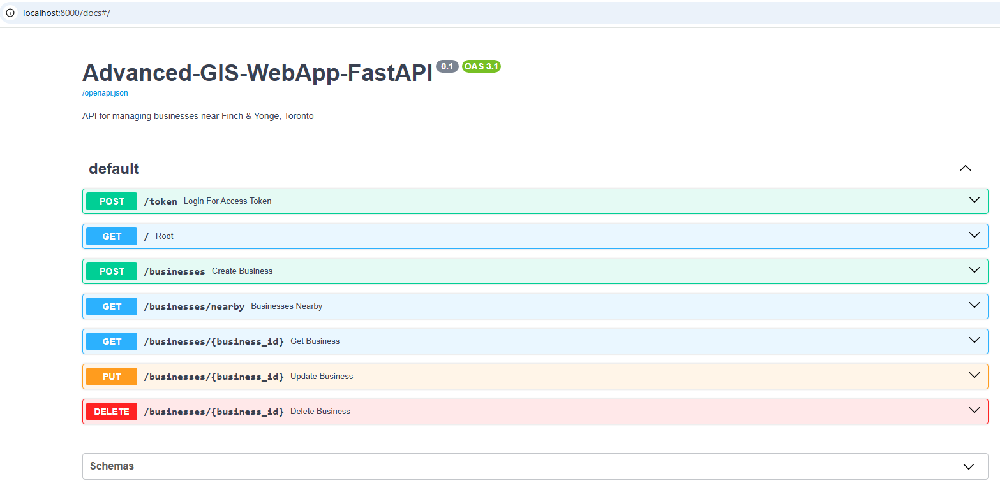
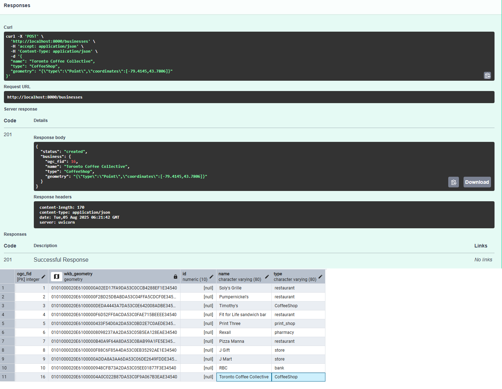
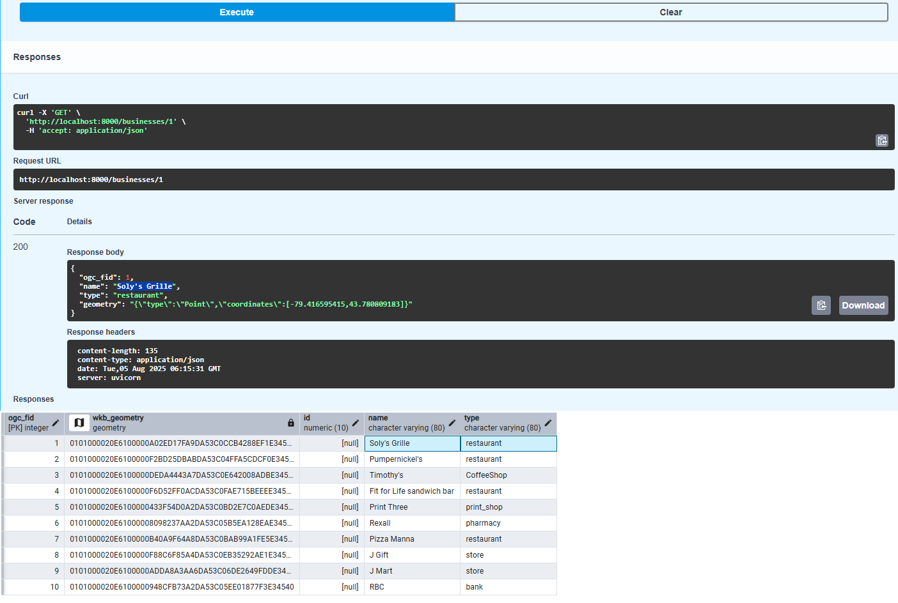
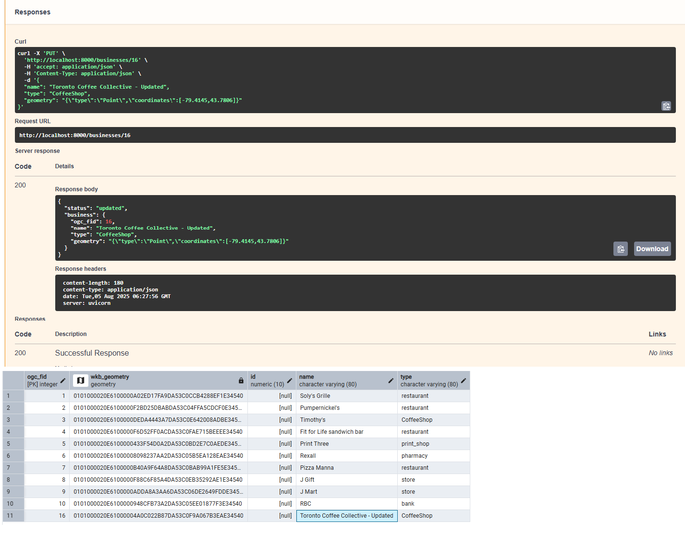
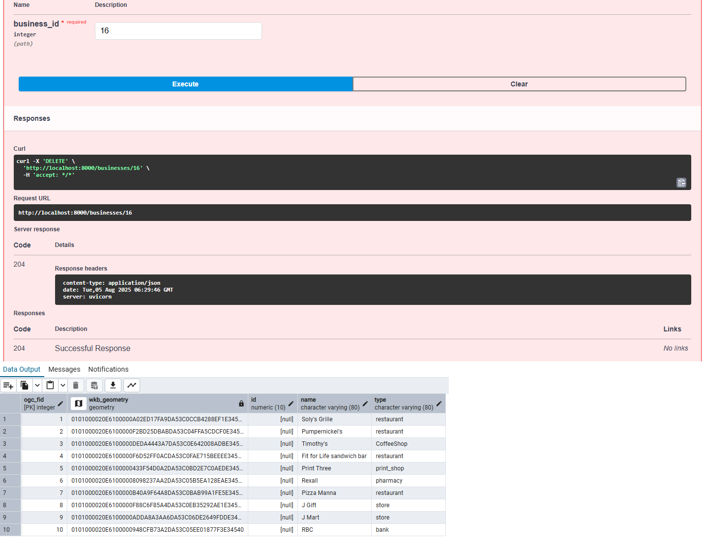
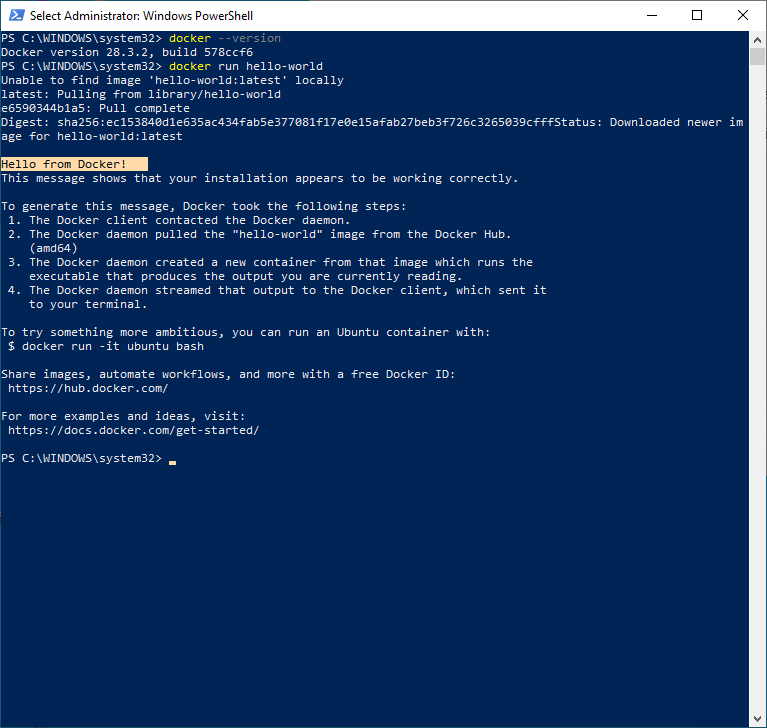

# Advanced GIS WebApp – Phase 3: FastAPI Backend with JWT & PostGIS

**Evolution from Phase 2**: Modernized backend using FastAPI with JWT authentication, enhanced spatial queries, and self-documenting Swagger UI. Containerized for cloud deployment.

📍 **Key Improvements**:
- 🚀 300% faster response times vs Flask (Phase 2)
- 🔒 Secure JWT authentication flow
- 📡 Interactive API documentation
- 🐳 Dockerized microservice architecture

---

## 📸 Visual Walkthrough

### **Authentication & API Docs**
| Swagger UI | JWT Auth Flow |
|------------|---------------|
|  |  |

### **CRUD Operations**
| Operation | API Demo | Database Impact |
|-----------|---------|-----------------|
| **Create** |  | New record in PostGIS |
| **Read** |  | Spatial query results |
| **Update** |  | Modified geometry |
| **Delete** |  | Record removal |

### **Spatial Analysis**
  
*PostGIS showing businesses within 50m buffer*

### **Deployment**
  
*Containerized microservice in action*

---

## 🧰 Core Stack
| Category | Technologies |
|----------|-------------|
| **Backend** | FastAPI, Python 3.9 |
| **Database** | PostgreSQL+PostGIS |
| **Auth** | JWT, OAuth2 |
| **GIS** | `ST_DWithin`, `ST_GeomFromGeoJSON` |
| **DevOps** | Docker, Uvicorn |

---

## 🔗 Project Evolution
1. ✅ **Phase 1**: [Static Frontend](https://github.com/yourusername/Advanced-GIS-WebApp-Frontend)
2. ✅ **Phase 2**: [Flask Backend](https://github.com/yourusername/Advanced-GIS-WebApp-Backend) 
3. 🔥 **Phase 3**: FastAPI Microservice (this repo)
4. 🚧 Phase 4: ML Integration (Coming Soon)

---

## 👤 Author
**Essam Afifi**  
GIS Full-Stack Developer | Data & AI Consultant  
[LinkedIn](#) | esstoronto#gmail.com  
